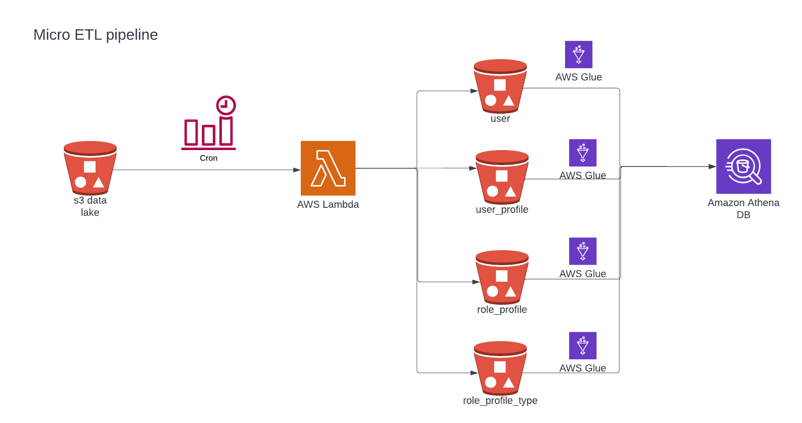

# AWS Micro ETL pipeline

## Loading Excel file 
- Design:
  - Given the limited time, I completed the normalization of data in the file using lambda for tables user, user_profile, role_profile and role_profile_type, with the understanding that these could be extended for the remaining tables in the data model. 
  - The reason I chose lambda is because the file is small in size. Depending on the size and set up, I would recommend a different solution.
  - I scheduled the lambda to [run every 15 minutes](micro-etl-app/template.yml) (an assumption). Again, depending on the use case my answer changes.
  - I made some assumptions about what could go in some of the incrementing primary keys given the limited scope and time as well as certain columns like updated, updated by and created, created_by.
  - I stored the resulting dataframes for these tables as CSV files in separate S3 buckets, so that it would be easier to connect with Athena for querying and AWS Glue for ETL to conform to any constraints or tranformations that may be necessary.
  
- Diagram:

- [Code](aws_micro_etl_sample.ipynb)

### AWS Free Tier offerings used:
- AWS S3: for data lake to Athena pipeline
- AWS Lambda: for micro-ETL
- AWS SAM: for building the environment, and scheduling the Lambda handler
- AWS Athena: to query resulting CSVs
- AWS Glue: to test out inserting rows into tables from the CSVs.

To review these, I am happy to share my screen during the interview or provide access to specific people on an ad-hoc basis. Currently, I have deleted some of the resources (such as the cloud formation stack) to avoid accidentally incurring charges, but I can deploy them to demonstrate my understanding again. 

#### Challenges:
- Converting the Excel file to CSV in AWS Lambda (since it does not natively support openpyxl or pandas) to make them query-able by Athena and Glue.
- I also avoided using anything that does not come for free with the free tier (such as RDS instances), and had to find workarounds for that.

## Recommended solution for database migration from on prem:
My code works for any excel files uploaded to S3 and ETLed at intervals. Since I had a static file, I took these liberties to implement a solution for the data the way I see fit. But because the source database is hosted on an SQL Server instance and not a few Excel files, my code is not the solution for the migration task at hand. 
I recommend using AWS Database Migration Service to migrate to RDS.

For this we would need to:
1. Create an SQL Server Database Instance in Amazon RDS.
2. Create a replication instance in DMS.
3. Create source and target endpoints for the migration.
4. Create replication tasks: I would recommend a single task of full load plus CDC for the simplicity and hastiness but since replication on both on-prem and AWS is desirable, we would have to create bidirectional replication tasks from the SQL Server instance to the RDS instance. This can be done by:
   - Creating a full load + CDC task from SQL Server to RDS.
   - Creating a CDC only task from RDS to SQL Server starting from the time before applications could make changes to RDS.
   - Loopback prevention settings to prevent corruption.

## License

This library is licensed under the MIT-0 License. See the LICENSE file.
